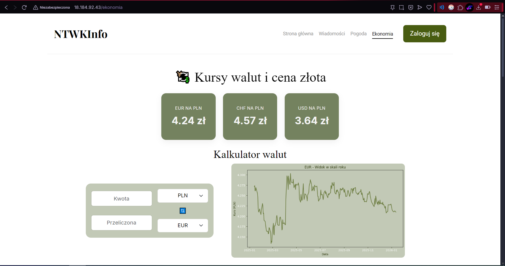

**NTwKInfo** – Nowoczesne Technologie w Kryminalistyce Information System

NTwKInfo to wielomodułowa aplikacja webowa, która integruje dane meteorologiczne, ekonomiczne i informacyjne z zewnętrznych źródeł API. Aplikacja jest przeznaczona dla studentów kierunku Nowoczesne Technologie w Kryminalistyce, umożliwiając im dostęp do aktualnych danych pogodowych, wskaźników ekonomicznych oraz wiadomości. Rozwiązuje problem fragmentacji informacji poprzez prezentację wszystkich danych w jednym, zunifikowanym interfejsie.

---

## Spis treści

- [Szybki start](#szybki-start)
- [Technologie](#technologie)
- [Moduły systemu](#moduły-systemu)
- [Dokumentacja (szczegóły)](#dokumentacja-szczegóły)
- [API (skrót)](#api-skrót)
- [Testowanie (skrót)](#testowanie-skrót)
- [Deployment](#deployment)
- [Proces i zasady pracy](#proces-i-zasady-pracy)
- [Autorzy i zespoły](#autorzy-i-zespoły)

---

## Szybki start

**Cel:** uruchomić aplikację lokalnie.

1. Sklonuj repozytorium:
   ```bash
   git clone https://github.com/MrN1co/NTwKInfo
   cd NTwKInfo
   ```

2. Utwórz środowisko wirtualne i aktywuj:
   ```bash
   python -m venv .venv
   # Windows:
   .venv\Scripts\activate
   # Linux/macOS:
   source .venv/bin/activate
   ```

3. Zainstaluj zależności:
   ```bash
   pip install -r requirements.txt
   ```

4. Skonfiguruj zmienne środowiskowe:
   - utwórz plik `.env` na podstawie `.env.example`
   - szczegóły w: [`docs/setup.md`](docs/setup.md)

5. Uruchom aplikację:
   ```bash
   python app.py
   ```

6. Otwórz w przeglądarce:
   - `http://127.0.0.1:5001/`

**Konto demonstracyjne:** tworzone automatycznie przy inicjalizacji bazy danych (szczegóły w `docs/SETUP.md`).

---

## Widoki aplikacji

### Strona główna


### Moduł pogodowy


### Moduł ekonomiczny


### Moduł wiadomości


---

## Technologie

**TU UZUPEŁNIĆ:** lista technologii (z krótkim uzasadnieniem „po co”)

- Python 3.9+ – backend, logika biznesowa
- Flask 2.3.0+ – framework webowy
- SQLAlchemy 2.0.0+ / SQLite – ORM i baza danych (bezpieczeństwo przed SQL injection)
- HTML5/CSS3/JavaScript – frontend, responsywny interfejs
- pytest – testy jednostkowe i integracyjne
- Playwright – testy akceptacyjne (E2E)
- Matplotlib, NumPy, Pandas – wizualizacja danych ekonomicznych i pogodowych
- Flask-WTF – CSRF Protection
- Flask-SQLAlchemy – mapowanie obiektowo-relacyjne
- python-dotenv – zarządzanie zmiennymi środowiskowymi

---

## Moduły systemu

Projekt został podzielony na moduły realizowane przez zespoły.

- **Strona główna** – agregacja skrótów / nawigacja / widoki wspólne  
  Dokumentacja modułu: [`docs/architecture/module_homepage.md`](docs/architecture/module_homepage.md)

- **Moduł pogodowy** – pobieranie i prezentacja danych pogodowych  
  Dokumentacja modułu: [`docs/architecture/module_weather.md`](docs/architecture/module_weather.md)

- **Moduł ekonomiczny** – pobieranie i prezentacja danych ekonomicznych  
  Dokumentacja modułu: [`docs/architecture/economics.md`](docs/architecture/economics.md)

- **Moduł wiadomości** – pobieranie i prezentacja wiadomości (np. lokalnych / tematycznych)  
  Dokumentacja modułu: [`docs/news_dokumentacja.md`](docs/news_dokumentacja.md)

---

## Dokumentacja (szczegóły)

Dokumentacja została podzielona na część ogólną oraz dokumentację modułów.
Zaleca się rozpoczęcie od [`docs/architecture.md`](docs/architecture.md), a następnie przejście do dokumentów modułów.<br>

Pełna dokumentacja techniczna znajduje się w katalogu [`docs/`](docs/).

- Architektura całej aplikacji: [`docs/architecture.md`](docs/architecture.md)
- Architektura modułów:
  - [`docs/architecture/module_homepage.md`](docs/architecture/module_homepage.md)
  - [`docs/architecture/module_weather.md`](docs/architecture/module_weather.md)
  - [`docs/architecture/economics.md`](docs/architecture/economics.md)
  - [`docs/news_dokumentacja.md`](docs/news_dokumentacja.md)
- Konfiguracja i `.env`: [`docs/setup.md`](docs/SETUP.md)
- Referencja API: [`docs/api_reference.md`](docs/api_reference.md)
- Testowanie: [`docs/testing.md`](docs/testing.md)
- Zasady pracy i kontrybucji: [`docs/contribution.md`](docs/contribution.md)
- Prowadzenie projektu (Scrum/podział zespołów): [`docs/project_management.md`](docs/project_management.md)

---

## API (skrót)

**Uwaga:** Poniższa tabela ma charakter poglądowy.
Pełna i wiążąca specyfikacja API znajduje się w [`docs/api_reference.md`](docs/api_reference.md)

**TU UZUPEŁNIĆ:** wstaw tabelę z najważniejszymi endpointami (5–8 pozycji).  
Szczegóły i przykłady użycia: [`docs/api_reference.md`](docs/api_reference.md)

| Metoda | Endpoint | Opis | Moduł |
|------:|----------|------|------|
| GET | `/` | Strona główna (dashboard) | Home |
| GET | `/auth/login` | Formularz logowania | Auth |
| POST | `/auth/register` | Rejestracja użytkownika | Auth |
| GET | `/weather` | Widok pogody z danymi meteorologicznymi | Weather |
| GET | `/ekonomia` | Widok danych ekonomicznych (kursy walut, złoto) | Economics |
| GET | `/news` | Widok agregacji wiadomości | News |
| POST | `/api/favorites` | Dodaj ulubioną lokalizację / walutę | Weather/Economics |

---

## Testowanie (skrót)

Szczegółowy opis planu testowania: [`docs/testing.md`](docs/testing.md)

Projekt wykorzystuje testy automatyczne oraz statyczną analizę kodu:
- Python: `flake8` (PEP 8),
- JavaScript: `eslint`.


### Unit tests (pytest)
```bash
pytest tests/unit/
```

### Testy integracyjne (endpointy HTML i API)
```bash
pytest tests/integration/
```

### Testy akceptacyjne (Playwright)
Wymaganie: **min. 1 test akceptacyjny na każde User Story**.

```bash
pytest tests/e2e/
```

Raporty z testów znajdują się w katalogu `reports/` i są generowane automatycznie przy uruchomieniu testów (JUnit XML, HTML).

---

## Znane ograniczenia

- Dane API są cachowane, co oznacza opóźnienie w aktualizacji (do kilku minut)
- Dostęp do niektórych API może być ograniczony w zależności od limitu zapytań

---
## Deployment

Projekt jest hostowany na AWS.

- **Aktualnie:** [AWS](http://18.184.92.43)
- **Konfiguracja:** zmienne środowiskowe w pliku `.env` (szczegóły w [`docs/setup.md`](docs/setup.md))

**Uwaga:** nie commitujemy sekretów do repozytorium. Zob. [`docs/setup.md`](docs/setup.md).

---

## Proces i zasady pracy

Projekt był realizowany w Scrum, z backlogiem User Stories oraz sprintami i taskami w Jira.

- Opis procesu (Scrum/Jira/podział zespołów): [`docs/project_management.md`](docs/project_management.md)
- Zasady pracy (Git workflow, PR, DoD): [`docs/contribution.md`](docs/contribution.md)

---

## Autorzy i zespoły

Projekt powstał w ramach przedmiotu **Inżynieria Oprogramowania** (semestr V) na kierunku **Nowoczesne Technologie w Kryminalistyce** w **AGH im. Stanisława Staszica w Krakowie** (rok akademicki 2025/2026).

- Zespół Home – strona główna, nawigacja, autoryzacja
- Zespół Weather – moduł pogodowy, wykresy, alarmy pogodowe
- Zespół Economics – moduł ekonomiczny, analiza danych finansowych
- Zespół News – agregacja wiadomości ze źródeł tematycznych

---

## Licencja (opcjonalnie)

Do użytku dydaktycznego w ramach przedmiotu Inżynieria Oprogramowania na AGH.