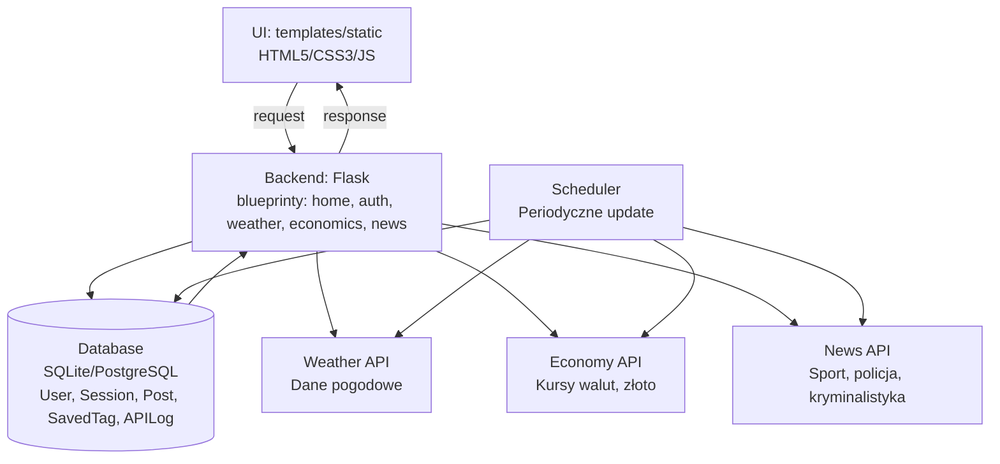

# Architektura aplikacji

## 1. Cel i zakres architektury

Dokument nie zawiera szczegółowych opisów architektury modułów ani endpointów – znajdują się one w dokumentacji modułów oraz [`api_reference.md`](api_reference.md).

Architektura opisuje wspólne elementy aplikacji webowej opartej na Flask, w tym warstwami UI, backendu, bazy danych i integracji z zewnętrznymi API. Dokument obejmuje stos technologiczny, konwencje nazewnictwa, model danych wspólny oraz decyzje architektoniczne. Nie zawiera szczegółowych algorytmów przetwarzania danych specyficznych dla poszczególnych modułów (pogoda, ekonomia, wiadomości), które opisane są w dokumentacji modularnej. Skupia się na infrastrukturze wspólnej, bezpieczeństwie oraz standardach, którymi przywiązują się wszystkie zespoły.

---

## 2. Widok systemu jako całości

Główne elementy systemu:
1. **Warstwa UI (templates/static)** – interfejs użytkownika oparty na HTML5, CSS3 i JavaScript, responsywny design
2. **Backend (Flask + blueprinty)** – aplikacja webowa z modulami (home, weather, economics, news), każdy z osobnym blueprintem
3. **Warstwa danych (DB + modele ORM)** – SQLAlchemy ORM, SQLite dla rozwoju, modele: User, Session, Post, SavedTag, APILog
4. **Integracje zewnętrzne** – API pogodowe, API ekonomiczne (kursy walut, ceny złota), API wiadomości (sport, policja, kryminalistyka)
5. **Autentykacja i autoryzacja** – system login/register, sesje użytkownika, ochrona CSRF
6. **Statyczna analiza kodu** – flake8 dla Python, eslint dla JavaScript
7. **Testy automatyczne** – pytest (unit/integration), Playwright (E2E)
8. **Hosting** – AWS E2
9. **Dokumentacja** – Markdown w `docs/`, architektura modułów, testy, contribution guidelines

---

## 3. Stos technologiczny (wspólny)

| Obszar | Technologia | Wersja | Rola w systemie / uzasadnienie |
|---|---|---:|---|
| Backend | Flask | 2.3.0+ | Framework webowy, lekki i elastyczny, idealne do aplikacji modularnych |
| Frontend | HTML5/CSS3/JavaScript | Wersja aktualna | Responsywny interfejs użytkownika, kompatybilny z nowoczesnymi przeglądarkami |
| Baza danych | SQLite (dev) / PostgreSQL (prod) | SQLite 3 | Bezpieczne przechowywanie danych, ORM zapobiega SQL injection |
| ORM | SQLAlchemy | 2.0.0+ | Mapowanie obiektowo-relacyjne, zmniejsza podatność na błędy |
| Testy | pytest / Playwright | Najnowsze | Unit testy, testy integracyjne, testy akceptacyjne (E2E) |
| Hosting | AWS | Skalowalność, wsparcie dla produkcji (EC2 / ECS) |
| Bezpieczeństwo | Flask-WTF | 1.1.0+ | CSRF Protection na wszystkich formularzach |
| Logowanie zmiennych | python-dotenv | 1.0.0+ | Zarządzanie zmiennymi środowiskowymi, brak sekretów w repo |

---

## 4. Konwencje i standardy w repozytorium

### 4.1 Struktura katalogów (skrót)

- `modules/` – główne moduły aplikacji (auth, database, main, scheduler)
- `modules/ekonomia/` – moduł ekonomiczny (kursy walut, ceny złota)
- `modules/weather_app.py` – moduł pogodowy
- `modules/news/` – moduł wiadomości (agregacja z różnych źródeł)
- `templates/` – szablony HTML (base.html, home, auth, moduły)
- `static/` – zasoby statyczne (CSS, JavaScript, obrazy)
- `tests/` – testy automatyczne (unit/, integration/, e2e/)
- `docs/` – dokumentacja techniczna (architektura, plany testów, setup)
- `data/` – dane z API (economics, news)
- `reports/` – raporty z testów (JUnit XML, HTML)

### 4.2 Konwencje nazewnictwa

- **Blueprinty:** `<module_name>_bp` (np. `auth_bp`, `weather_bp`, `ekonomia_bp`, `tables_bp`)
- **Endpointy:** wersja EN, prefiksowane `/` (np. `/`, `/auth/login`, `/weather`, `/ekonomia`, `/news`)
- **Pliki Python:** `snake_case` (np. `database.py`, `scheduler.py`, `weather_app.py`)
- **Klasy (ORM):** `PascalCase` (np. `User`, `Session`, `Post`, `SavedTag`, `APILog`)
- **Funkcje/metody:** `snake_case` (np. `init_db()`, `create_app()`, `init_news_module()`)
- **Zmienne środowiskowe:** `UPPER_SNAKE_CASE` (np. `DATABASE_URL`, `SECRET_KEY`, `DEBUG`)
- **Szablony:** `<module>/<template_name>.html` (np. `base.html`, `auth/login.html`)

### 4.3 Wspólne biblioteki / utilities

- **Konfiguracja:** `config.py` – BaseConfig, DevelopmentConfig, TestingConfig, ProductionConfig
- **Baza danych:** `modules/database.py` – SQLAlchemy ORM, modele (User, Session, Post, SavedTag, APILog)
- **Autentykacja:** `modules/auth.py` – logowanie, rejestracja, obsługa sesji
- **Zmienne środowiskowe:** `.env` + `python-dotenv` – zasilanie zmiennych bez commitów
- **Scheduler:** `modules/scheduler.py` – periodyczne zadania (aktualizacja danych API)
- **CSRF Protection:** `Flask-WTF` – ochrona wszystkich POST na formularzach
- **Obsługa błędów:** Flask error handlers (400, 404, 500)
- **Logowanie:** built-in Python logging, potencjalnie plik logów

---

## 5. Komponenty i zależności

### 5.1 Diagram architektury (wymagany)

Wstaw diagram pokazujący elementy systemu: UI → Flask → DB → API zewnętrzne.

---

## 6. Przepływ danych (Data Flow)
Opis dotyczy ogólnego przepływu danych w aplikacji, niezależnie od konkretnego modułu.

1. **Użytkownik interaktuje z UI** – przegląda stronę, kliknie endpoint (GET/POST)
2. **Flask odbiera request** – routing do odpowiedniego blueprintu i funkcji obsługi
3. **Walidacja danych** – Flask-WTF sprawdza CSRF token, WTForms waliduje dane formularza
4. **Przetwarzanie biznesowe** – logika modularnych (pobieranie z API, obliczenia, transformacje)
5. **Interakcja z DB** – SQLAlchemy zapisuje/pobiera dane (User, SavedTag, APILog itp.)
6. **Pobieranie danych z API** – asynchroniczne lub w Schedulerze (pogoda, ekonomia, wiadomości)
7. **Cachowanie** – dane są przechowywane w DB (APILog), data ostatniej aktualizacji
8. **Renderowanie szablonu** – Flask zwraca HTML z parametrami z DB i API
9. **Odpowiedź UI** – użytkownik widzi dane na stronie

---

## 7. Model danych (część wspólna)

### Cel sekcji

Celem tej sekcji jest opisanie **wspólnego modelu danych aplikacji**, czyli encji
i relacji, które mają charakter **przekrojowy** i nie są przypisane wyłącznie
do jednego modułu systemu.

> **Ważne:**  
> W tej sekcji **nie opisujemy danych stricte modułowych**  
> (np. danych pogodowych, ekonomicznych, wiadomości itp.).  
> Dane specyficzne dla poszczególnych modułów należy opisać
> w dokumentacji architektury odpowiednich modułów:
> `docs/architecture/<module>.md`.

---

### 7.1 Zakres modelu danych wspólnego

Wspólny model danych obejmuje **encje bazodanowe**, które spełniają
co najmniej jedno z poniższych kryteriów:

- są wykorzystywane przez **więcej niż jeden moduł aplikacji**,  
- stanowią **rdzeń systemu**, niezależnie od modułów
  (np. użytkownicy, sesje, logi, konfiguracja),
- realizują **funkcje przekrojowe** (cross-cutting concerns),
  takie jak bezpieczeństwo, audyt czy monitorowanie.

Encje, które są używane **wyłącznie w jednym module**,
powinny być opisane w dokumentacji architektury tego modułu.

---

### 7.2 Encje wspólne i ich odpowiedzialność

Encja: **User**
- Rola: reprezentuje użytkownika aplikacji, wykorzystywana przez wszystkie moduły (auth, favorites, profil)
- Atrybuty: id, username, email, password_hash, created_at, is_active
- Relacje: Session (1:N), APILog (1:N), Post (1:N), SavedTag (1:N)

Encja: **Session**
- Rola: przechowuje aktywne sesje użytkowników
- Atrybuty: id, user_id, session_token, expires_at, created_at
- Relacje: User (N:1)

Encja: **SavedTag**
- Rola: przechowuje ulubione lokalizacje/waluty dla każdego użytkownika
- Atrybuty: id, user_id, tag_name, tag_type (location/currency), created_at
- Relacje: User (N:1)

Encja: **APILog**
- Rola: loguje zapytania do zewnętrznych API (pogoda, ekonomia, wiadomości), audyt i monitoring
- Atrybuty: id, user_id, api_name, endpoint, status_code, response_time, created_at
- Relacje: User (N:1)

Encja: **Post**
- Rola: przechowuje posty/artykuły (opcjonalnie dla przyszłych funkcji) 
- Atrybuty: id, title, content, author_id, created_at, updated_at
- Relacje: User (N:1)

## 8. Cross-cutting concerns (wspólne aspekty)

### 8.1 Konfiguracja i sekrety (.env)

Szczegóły w: [`docs/setup.md`](setup.md)

Konfiguracja ładowana z `.env` za pomocą `python-dotenv`. Plik `.env` jest ignorowany w `.gitignore`, aby nie commitować sekretów do repo. Plik `.env.example` zawiera template wszystkich wymaganych zmiennych. Każda zmienna środowiskowa ma domyślną wartość w `config.py` na wypadek jej braku. Sekretne zmienne: `SECRET_KEY`, `DATABASE_URL`.

### 8.2 Obsługa błędów i logowanie

Błędy Flask są obsługiwane przez wbudowane error handlers (400, 404, 500). HTTPException dla błędów HTTP, generyczne Exception dla aplikacyjnych. Logowanie używa wbudowanego modułu `logging` Python. Logi trafiają do konsoli (dev) i opcjonalnie do plików. Format logowania: timestamp, level (INFO/DEBUG/ERROR), wiadomość.

### 8.3 Bezpieczeństwo

Walidacja danych: WTForms na backendzie (email, długość hasła, itp.). 
Ochrona CSRF: Flask-WTF, token na wszystkich formularzach (POST). 
SQL injection prevention: SQLAlchemy ORM z parameterized queries. 
Brak sekretów w repo: zmienne środowiskowe w `.env` (ignorowane w git). 
Hasła: hashowanie za pomocą werkzeug.security (generate_password_hash, check_password_hash). 
HTTPS (planowany dla produkcji na AWS). 
Sessions: Flask Sessions z httponly cookies.

---

## 9. Decyzje architektoniczne (ADR-lite)

- **Decyzja:** Wykorzystanie Flask zamiast innego frameworka (Django, FastAPI)  
  **Powód:** Lekkość, elastyczność, łatwość w nauce, dobrze do aplikacji modularnych  
  **Konsekwencje:** Większa kontrola nad architekturą, mniej "magii" frameworka, ale wymaga więcej ręcznej integracji ORM/auth

- **Decyzja:** Blueprinty dla każdego modułu  
  **Powód:** Separacja kodu, łaska podział pracy między zespołami  
  **Konsekwencje:** Modularna aplikacja, łatwa do testowania i rozszerzona  

- **Decyzja:** SQLAlchemy ORM zamiast surowego SQL  
  **Powód:** Bezpieczeństwo (SQL injection prevention), portabilność baz danych  
  **Konsekwencje:** Nieco wolniej, ale lepsze bezpieczeństwo i utrzymalność  

- **Decyzja:** SQLite dla dev, PostgreSQL planowany dla prod  
  **Powód:** Szybki start (SQLite), skalowalność (PostgreSQL)  
  **Konsekwencje:** Wymaga migracji na zmianę bazy  

- **Decyzja:** pytest + Playwright dla testów (unit + E2E)  
  **Powód:** Kompleksowe pokrycie, automatyzacja testów interfejsu użytkownika  
  **Konsekwencje:** Czas na pisanie testów, ale poważnę zwrotne sygnały  

- **Decyzja:** Flask-WTF dla CSRF Protection  
  **Powód:** Standardowe bezpieczeństwo web aplikacji  
  **Konsekwencje:** Dodatek do każdego formularza, ale chroni przed atakami  

---

## 10. Powiązanie architektury z modułami

Linki do architektury modułów:
- Home: [`architecture/module_homepage.md`](architecture/module_homepage.md)
- Weather: [`architecture/module_weather.md`](architecture/module_weather.md)
- Economy: [`architecture/economics.md`](architecture/economics.md)
- News: [`news_dokumentacja.md`](../news_dokumentacja.md)

---

## 11. Ograniczenia, ryzyka i dalszy rozwój

**Ograniczenia:**
- Cachowanie danych API jest proste (przechowywanie w DB), brak Redis
- Scheduler uruchamia się lokalnie 
- Frontend bez frameworka (Vue/React) – szablonowanie Jinja2

**Ryzyka:**
- Limit zapytań API (pogoda, ekonomia, wiadomości) – może zablokować aplikację
- Brak load testowania przed produkcją
- Dane osobiste użytkowników (email, hasło) wymaga HTTPS w produkcji
- Scheduler może się "zawiesić" bez monitorowania

**Propozycje usprawnień:**
- Dodanie Redis dla cache’u danych API i sesji
- Frontend frameworkiem (Vue 3 lub React)
- Load testing przed produkcją (Apache JMeter, Locust)
- Integracja CI/CD (GitHub Actions, GitLab CI)