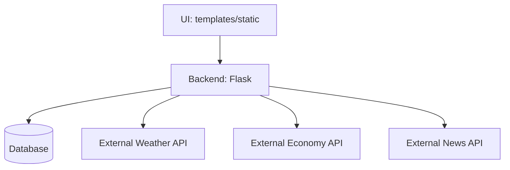

# Architektura aplikacji (wspólna) — TEMPLATE

> **Instrukcja:**  
> Uzupełnij wszystkie miejsca oznaczone **TU UZUPEŁNIĆ**.  
> Ten plik opisuje **wspólne elementy całej aplikacji**.  
> Szczegóły modułów znajdują się w:
> - `doc/architecture/home.md`
> - `doc/architecture/weather.md`
> - `doc/architecture/economy.md`
> - `doc/architecture/news.md`

---

## 1. Cel i zakres architektury

Dokument nie zawiera szczegółowych opisów architektury modułów ani endpointów – znajdują się one w dokumentacji modułów oraz api_reference.md.

**TU UZUPEŁNIĆ:** 3–6 zdań o tym, co obejmuje architektura (co opisuje, a czego nie).

---

## 2. Widok systemu jako całości

**TU UZUPEŁNIĆ:** opisz w 5–10 punktach główne elementy systemu i ich role.

Przykładowy podział:
- Warstwa UI (templates/static)
- Backend (Flask + blueprinty)
- Warstwa danych (DB + modele)
- Integracje zewnętrzne (API pogody / ekonomii / wiadomości)
- Hosting (AWS)

---

## 3. Stos technologiczny (wspólny)

>**Instrukcja:** Uzupełnij poniższa tabelę. Nie wpisujemy tu bibliotek specyficznych dla jednego modułu (np. konkretnego API pogodowego.

| Obszar | Technologia | Wersja | Rola w systemie / uzasadnienie |
|---|---|---:|---|
| Backend | Flask | **TU UZUPEŁNIĆ** | **TU UZUPEŁNIĆ** |
| Frontend | HTML/CSS/JS | **TU UZUPEŁNIĆ** | **TU UZUPEŁNIĆ** |
| Baza danych | **TU UZUPEŁNIĆ** | **TU UZUPEŁNIĆ** | **TU UZUPEŁNIĆ** |
| Testy | pytest / Playwright | **TU UZUPEŁNIĆ** | **TU UZUPEŁNIĆ** |
| Hosting | AWS | **TU UZUPEŁNIĆ** | **TU UZUPEŁNIĆ** |

---

## 4. Konwencje i standardy w repozytorium

### 4.1 Struktura katalogów (skrót)

**TU UZUPEŁNIĆ:** opisz najważniejsze katalogi (np. `app/`, `templates/`, `static/`, `tests/`, `doc/`).

### 4.2 Konwencje nazewnictwa

**TU UZUPEŁNIĆ:** np. blueprinty, endpointy, nazwy plików, klasy, funkcje.

### 4.3 Wspólne biblioteki / utilities

**TU UZUPEŁNIĆ:** np. moduł do logowania, konfiguracji `.env`, obsługi błędów, wrapperów do API.

---

## 5. Komponenty i zależności

### 5.1 Diagram architektury (wymagany)

Wstaw diagram pokazujący elementy systemu: UI → Flask → DB → API zewnętrzne.

**Opcja A: Mermaid (zalecana na GitHub)**



**TU UZUPEŁNIĆ:** dostosuj nazwy, dodaj brakujące elementy (np. cache, kolejkę, itp.).

**Opcja B: Obraz w `doc/assets/diagrams/`**
- Umieść plik np. `doc/assets/diagrams/system-architecture.png`
- Wstaw w MD:
  ```md
  
  ```

---

## 6. Przepływ danych (Data Flow)
Opis dotyczy ogólnego przepływu danych w aplikacji, niezależnie od konkretnego modułu.

**TU UZUPEŁNIĆ:** opisz:
- skąd przychodzą dane (API zewnętrzne / UI)
- gdzie są walidowane i przetwarzane
- jak i gdzie są zapisywane do DB
- jak odczytywane do widoków i endpointów

Możesz użyć listy kroków:

1. **TU UZUPEŁNIĆ**
2. **TU UZUPEŁNIĆ**
3. **TU UZUPEŁNIĆ**

---

## 7. Model danych (część wspólna)

### Cel sekcji

Celem tej sekcji jest opisanie **wspólnego modelu danych aplikacji**, czyli encji
i relacji, które mają charakter **przekrojowy** i nie są przypisane wyłącznie
do jednego modułu systemu.

> **Ważne:**  
> W tej sekcji **nie opisujemy danych stricte modułowych**  
> (np. danych pogodowych, ekonomicznych, wiadomości itp.).  
> Dane specyficzne dla poszczególnych modułów należy opisać
> w dokumentacji architektury odpowiednich modułów:
> `doc/architecture/<module>.md`.

---

### 7.1 Zakres modelu danych wspólnego

Wspólny model danych obejmuje **encje bazodanowe**, które spełniają
co najmniej jedno z poniższych kryteriów:

- są wykorzystywane przez **więcej niż jeden moduł aplikacji**,  
- stanowią **rdzeń systemu**, niezależnie od modułów
  (np. użytkownicy, sesje, logi, konfiguracja),
- realizują **funkcje przekrojowe** (cross-cutting concerns),
  takie jak bezpieczeństwo, audyt czy monitorowanie.

Encje, które są używane **wyłącznie w jednym module**,
powinny być opisane w dokumentacji architektury tego modułu.

---

### 7.2 Encje wspólne i ich odpowiedzialność

W tej podsekcji należy opisać **encje wspólne aplikacji**.

Dla każdej encji należy podać:
- nazwę encji (tabeli),
- krótką charakterystykę jej roli w systemie,
- najważniejsze atrybuty (bez opisywania wszystkich pól),
- relacje z innymi encjami wspólnymi lub modułami.

> **Instrukcja:**  
> Nie zakłada się konkretnego zestawu encji – opis zależy od projektu.
> Ważne jest **uzasadnienie**, dlaczego dana encja została uznana za wspólną.

**TU UZUPEŁNIĆ**

Przykład (schematyczny):
```text
Encja: User
Rola: reprezentuje użytkownika aplikacji i jest wykorzystywana przez wiele modułów.
Relacje: Session (1:N), APILog (1:N)
```

## 8. Cross-cutting concerns (wspólne aspekty)

### 8.1 Konfiguracja i sekrety (.env)

Szczegóły w: [`doc/setup.md`](setup.md)

**TU UZUPEŁNIĆ:** np. gdzie ładowane, jak zabezpieczone, `.env.example`.

### 8.2 Obsługa błędów i logowanie

**TU UZUPEŁNIĆ:** jak logujecie błędy, jaki format, gdzie trafiają logi.

### 8.3 Bezpieczeństwo (minimum)

**TU UZUPEŁNIĆ:** np. walidacja danych, brak sekretów w repo, podstawowe zabezpieczenia formularzy.

---

## 9. Decyzje architektoniczne (ADR-lite)

Wypisz 3–8 decyzji architektonicznych w formacie:

- **Decyzja:** TU UZUPEŁNIĆ  
  **Powód:** TU UZUPEŁNIĆ  
  **Konsekwencje:** TU UZUPEŁNIĆ  

---

## 10. Powiązanie architektury z modułami

Linki do architektury modułów:
- Home: [`doc/architecture/home.md`](architecture/home.md)
- Weather: [`doc/architecture/weather.md`](architecture/weather.md)
- Economy: [`doc/architecture/economy.md`](architecture/economy.md)
- News: [`doc/architecture/news.md`](architecture/news.md)

---

## 11. Ograniczenia, ryzyka i dalszy rozwój

**TU UZUPEŁNIĆ:** krótka lista ograniczeń i ryzyk + propozycje usprawnień.
