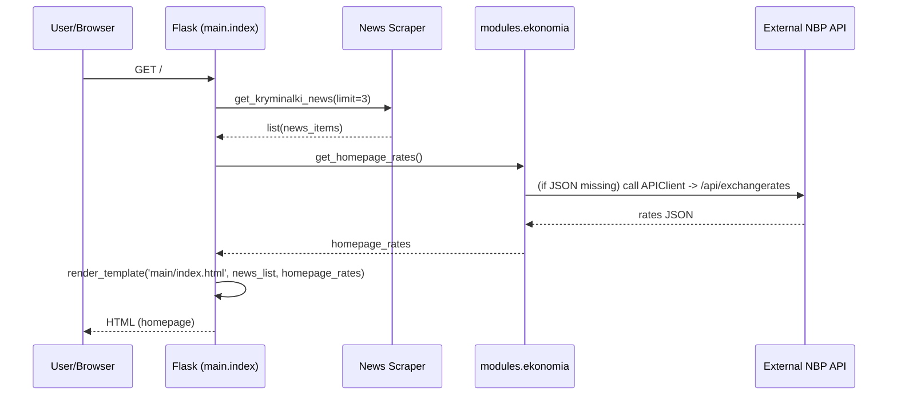

# Architektura modułu: Moduł `strona główna`

> **Cel dokumentu:**
> Ten dokument odpowiada na pytanie: **„Jak ten konkretny moduł działa i na jakich danych operuje?”**

---

## 1. Cel modułu

Moduł `strona główna` agreguje i prezentuje informacje startowe aplikacji: najnowsze wiadomości (z dostępnych scraperów), skrócone kursy walut i widgety (kalendarz, ciekawostka dnia). Odpowiada za złożenie danych z serwisów wewnętrznych (`modules.news`, `modules.ekonomia`) i wygenerowanie widoku HTML dla użytkownika (GET `/`). Nie przechowuje własnych encji w bazie — jedynie przygotowuje dane do renderingu.

---

## 2. Zakres funkcjonalny (powiązanie z User Stories)

- **US-HOME-101** — Jako anonimowy użytkownik chcę zobaczyć stronę główną z listą najnowszych artykułów i kursami walut.
- **US-HOME-102** — Jako użytkownik chcę się zarejestrować i zalogować z poziomu strony głównej (modal auth).
- **US-HOME-103** — Jako zalogowany użytkownik chcę zapisać preferencje (tagi), aby personalizować treści.
- **US-HOME-104** — Jako użytkownik chcę widzieć kalendarz i krótki fakt dnia (zewnętrzny feed).
- **US-HOME-105** — Jako użytkownik chcę, żeby strona główna była responsywna (desktop/mobile).
- **US-HOME-106** — Jako deweloper chcę, by podstawowe elementy UI (header/footer, klas CSS) były spójne i testowalne.

---

## 3. Granice modułu (co wchodzi / co nie wchodzi)

### 3.1 Moduł odpowiada za
- Pobranie i agregację **najnowszych artykułów** (via `modules.news.collectors.get_kryminalki_news` oraz inne collectory).
- Pobranie **kursów walut** do kafli na stronie (via `modules.ekonomia.get_homepage_rates`).
- Renderowanie widoku `templates/main/index.html` z danymi: `news_list`, `homepage_rates`.
- Udostępnienie prostych redirectów do innych funkcji (`/news`, `/ekonomia`, `/pogoda`) i zabezpieczonego dashboardu (`/dashboard`).

### 3.2 Moduł nie odpowiada za
- Autoryzację/odpowiedzialności kont użytkowników (realizowane przez `modules.auth`).
- Zbieranie i normalizację danych ekonomicznych / historycznych (realizowane przez `modules.ekonomia`).
- Stałe przechowywanie danych (persistencja artykułów/aktualności) — moduł jedynie wyświetla agregowane dane.

---

## 4. Struktura kodu modułu

Najważniejsze pliki i katalogi:
- `modules/main/__init__.py` — główny blueprint `main_bp`, endpoint-y (`/`, `/news`, `/ekonomia`, `/pogoda`, `/dashboard`).
- `modules/main/helpers.py` — czyste funkcje pomocnicze (unit-testable): `select_featured_article`, `summarize`, `format_published_date`.
- `templates/main/index.html` — główny szablon HTML strony głównej.
- `static/js/` — skrypty (kalendarz: `script-calendar.js`, obsługa auth modal itp.).
- Testy:
  - Unit: `tests/unit/main/test_helpers.py`
  - Integration: `tests/integration/main/test_main_integration.py`
  - E2E (Playwright): `tests/e2e/test_homepage_user_stories.py`

---

## 4a. Rejestr plików modułu (dokładne lokalizacje i komponenty)

### 4a.1 Pliki HTML (szablony)

| Plik | Lokalizacja | Linie | Kluczowe komponenty | Przeznaczenie |
|---:|---|---|---|---|
| **Homepage** | `templates/homepage.html` | 1-128 | `.carousel-slide` (L22, L64) · `.main-article-carousel` (L21) · `.weather-box` (L84-92) · `.exchange-rates` (L94-107) | Strona główna: karuzela artykułów, pogoda statyczna (Kraków), tabela kursów walut (USD/EUR/GBP/CHF) |
| **Base Layout** | `templates/base.html` | 1-120 | `#authOverlay` (L16) · `#authModal` (L19) · `#loginForm` (L22-42) · `#registerForm` (L44-68) · `.header` (L73-92) · `.footer` (L110-120) | Master template: modal autoryzacji (login/rejestracja), nagłówek z nawigacją, stopka; `` dla stron potomnych |
| **Dashboard** | `templates/auth/dashboard.html` | 1-100 | `.dashboard-grid` (L15) · `.dashboard-card` (L17, L39, L66) · `.action-btn.primary` (L43) · `.action-btn.secondary` (L48, L53, L58) · `.quick-link` (L74-79) | Pulpit użytkownika zalogowanego: 3 karty (Info konta, Akcje, Szybkie linki) |

### 4a.2 Pliki CSS (arkusze stylów)

| Plik | Lokalizacja | Linie | Kluczowe klasy | Przeznaczenie |
|---:|---|---|---|---|
| **Main Styles** | `static/css/style.css` | 1-1046 | `:root` (L6-51) · `.header` (L54-198) · `.carousel-container` (L198-280) · `.auth-modal` (L580-680) · `.content-grid` (L230-275) · Media queries (L330-500) | Główny arkusz: zmienne CSS (kolory), styl nagłówka/nawigacji, animacje karuzeli, modal autoryzacji, layout responsywny (mobile/tablet/desktop) |
| **Dashboard Styles** | `static/css/dashboard.css` | 1-300 | `.dashboard-grid` (L34-39) · `.dashboard-card` (L41-60) · `.action-btn.primary` (L125-135) · `.action-btn.secondary` (L137-149) · Media queries (L260-300) | Styl pulpitu: grid responsywny (auto-fit minmax), karty z efektem hover (lift), przyciski (primary/secondary), breakpointy (600px, 1024px) |

### 4a.3 Pliki JavaScript (skrypty interaktywne)

| Plik | Lokalizacja | Linie | Kluczowe funkcje | Przeznaczenie |
|---:|---|---|---|---|
| **Carousel** | `static/js/script-carousel.js` | 1-70 | `showSlide(index)` (L20-26) · `restartTimer()` (L28-38) · `.carousel-button.next` listener (L47-55) · `.carousel-button.prev` listener (L57-65) | Automatyczna karuzela artykułów: zmiana slajdu co 7 sekund (setInterval L35), modulo wrapping L36, restart przy kliknięciu |
| **Calendar** | `static/js/script-calendar.js` | 1-74 | `polishMonths[]` (L24-31) · `polishMonthsShort[]` (L33) · `fetch(https://pniedzwiedzinski.github.io/...)` (L50-70) | Pobieranie i wyświetlanie daty + faktów z API: formatting datę (DD Miesiąc YYYY), obsługa błędów, fallback "Brak świąt" |
| **Auth Modal** | `static/js/script-auth.js` | 1-77 | `openModal(form)` (L30-44) · `closeModal()` (L47-51) · Event listeners (L53-77) | Obsługa modalu logowania: pokazanie/ukrycie formularzy (login/register), przełączanie między formularzami |

### 4a.4 Pliki testów (testy automatyczne)

| Plik | Lokalizacja | Linie | Klasa/Funkcje | Liczba testów | Testuje |
|---:|---|---|---|---|---|
| **Unit Tests** | `tests/unit/main/test_helpers.py` | 1-109 | `TestHelpers` (L8) · `test_select_featured_with_items` (L21) · `test_select_featured_empty` (L34) · `test_summarize_short` (L46) · `test_summarize_trim` (L59) · `test_format_published_iso` (L74) · `test_format_published_simple` (L86) · `test_format_published_invalid` (L98) | 7 | Funkcje pomocnicze: wybór artykułu wyróżnionego, streszczanie tekstu, formatowanie dat |
| **Integration Tests** | `tests/integration/main/test_main_integration.py` | 1-140 | `test_index_renders_with_news_and_rates` (L56) · `test_index_renders_empty_news` (L93) · `test_helper_redirects` (L116) | 3 | Renderowanie strony głównej (GET /), fallback braku wiadomości, redirecty (/news, /ekonomia) |
| **E2E Tests** | `tests/e2e/test_homepage_user_stories.py` | 1-274 | `TestHomepageUserStories` (L4) · `test_register_and_login` (L19) · `test_personalization_and_saved_tags` (L81) · `test_calendar_date_and_facts` (L148) · `test_responsiveness` (L186) · `test_anonymous_access` (L219) · `test_ui_consistency` (L243) | 6 | Scenariusze użytkownika (E2E Playwright): rejestracja, login, personalizacja, kalendarz, responsywność, spójność UI |

### 4a.5 Pliki dokumentacji

| Plik | Lokalizacja | Linie | Zawartość | Rola |
|---:|---|---|---|---|
| **Test Plan** | `docs/tests/TEST_PLAN_homepage.md` | 1-76 | Przegląd testów jednostkowych (U1-U3), integracyjnych (I1-I3), E2E (S1-S8) | Plan testowania modułu homepagem (mapowanie User Stories ↔ testy) |
| **Module Architecture** | `docs/architecture/module_homepage.md` | 1-207 (ten plik) | Cel, zakres, granice, struktura, interfejs API, zewnętrzne API, model danych, przepływ danych, diagramy, testy, ograniczenia | Główny dokument architektury (kompleksowe wyjaśnienie jak moduł działa) |

### 4a.6 Macierz pokrycia testów (Test Coverage Matrix)

Poniższa tabela pokazuje, które testy pokrywają które komponenty implementation:

| Komponent Implementation | Unit Tests | Integration Tests | E2E Tests |
|---|---|---|---|
| `templates/homepage.html` (carousel, weather, rates) | — | `test_index_renders_*` (I1, I2) | `test_anonymous_access` (S8) · `test_ui_consistency` (S8) |
| `templates/base.html` (auth modal) | — | — | `test_register_and_login` (S3) · `test_personalization_*` (S2) |
| `templates/auth/dashboard.html` | — | — | `test_personalization_and_saved_tags` (S2) |
| `static/css/style.css` (layout, modal) | — | — | `test_ui_consistency` (S8) · `test_responsiveness` (S7) |
| `static/css/dashboard.css` (grid, buttons) | — | — | `test_responsiveness` (S7) |
| `static/js/script-carousel.js` | — | — | `test_ui_consistency` (S8) - carousel automatics |
| `static/js/script-calendar.js` | — | — | `test_calendar_date_and_facts` (S5, S6) |
| `static/js/script-auth.js` | — | — | `test_register_and_login` (S3) · `test_personalization_*` (S2) |
| `modules/main/helpers.py` | `test_select_featured_*` (U1) · `test_summarize_*` (U2) · `test_format_published_*` (U3) | — | — |
| `modules/main/__init__.py` (GET /) | — | `test_index_renders_*` (I1, I2) | `test_anonymous_access` (S8) · `test_ui_consistency` (S8) |

---

## 5. Interfejs modułu

| Metoda | Ścieżka | Typ | Rola w module | Powiązane US | Szczegóły |
|---:|---|---|---|---|---|
| GET | `/` | HTML | Render strony głównej (news + rates + widgets) | US-HOME-101 | `modules/main/__init__.py#index` |
| GET | `/news` | redirect → `tables.news` | Przekierowanie do sekcji news | US-HOME-101 | redirect via `url_for('tables.news')` |
| GET | `/ekonomia` | HTML | Wywołuje `modules.ekonomia.ekonomia()` (pełna strona ekonomia) | US-HOME-101 | render via ekonomia module |
| GET | `/ekonomia/chart/<currency_code>` | JSON | AJAX: wykres waluty (base64) | US-HOME-101 | `modules.ekonomia.get_currency_chart` |
| GET | `/pogoda` | redirect → `weather.weather_index` | Przekierowanie do pogody | US-HOME-101 | redirect |
| GET | `/dashboard` | HTML (login required) | Widok dashboard (zależny od `modules.auth`) | US-HOME-102 | `@login_required` |

Szczegółowa specyfikacja API (parametry, odpowiedzi) znajduje się w `doc/api_reference.md` (jeśli wymagana).

---

## 6. Zewnętrzne API wykorzystywane przez moduł

- **Kryminalki (https://www.kryminalki.pl)**  
  - Typ: publiczny serwis WWW — dane pobierane przez scraper (`modules/news/collectors/kryminalki_scraper.py`).  
  - Autoryzacja: brak (scraping).  
  - Limity: brak oficjalnych limitów — ryzyko blokad przy zbyt częstych żądaniach.  
  - Mapowanie: artykuł → dict: `{title, link, image, date, timestamp, tags}`.

- **NBP API (https://api.nbp.pl/api)** — pośrednio przez `modules.ekonomia.klasy_api_obsluga.APIClient`.  
  - Typ: publiczne API (exchange rates, gold prices).  
  - Autoryzacja: brak (publiczne).  
  - Limity: zgodne z polityką NBP (należy traktować jako zewnętrzne i podatne na dostępność).  
  - Mapowanie: odpowiedź → JSON → DataFrame / wartości numeryczne używane w `get_homepage_rates`.

- **Kalendarz (https://pniedzwiedzinski.github.io/kalendarz-swiat-nietypowych/)**  
  - Używane przez front-end JS do pobrania faktu dnia (fetch z poziomu przeglądarki).

### 6.1 Konfiguracja (zmienne `.env`)

W aktualnej implementacji nie ma bezpośrednich zmiennych `.env` wymaganych przez `modules/main`. Rekomendacje:
- `NBP_BASE_URL` | `https://api.nbp.pl/api` | Base URL dla NBP API (zalecane do konfiguracji) | NIE (opcjonalne)
- `SCRAPER_TIMEOUT` | `10` | Timeout (sekundy) dla requestów scraperskich | NIE (opcjonalne)

> Szczegóły konfig: `doc/setup.md`

### 6.2 Przykład zapytania do API (opcjonalnie)
```bash
# Pobranie wykresu waluty (AJAX)
GET /ekonomia/chart/EUR
# API NBP (używane przez Manager / APIClient)
GET https://api.nbp.pl/api/exchangerates/tables/a/?format=json
```

### 6.3 Obsługa błędów i fallback
- Jeśli scraper `get_kryminalki_news` nie działa (timeout / błąd HTTP / parsing) → zwraca pustą listę (trace błędu logowany), a widok pokazuje fallback (np. "Brak wiadomości").
- `get_homepage_rates` najpierw próbuje lokalnych JSONów (snapshoty), a jeśli brak, próbuje pobrać bieżące kursy przez `Manager().currencies`. Jeśli i to zawiedzie, brakujące waluty są pomijane (widoczna jest jedynie dostępna część danych).
- Zewnętrzne żądania front-endu (kalendarz) powinny być zabezpieczone w testach (mock/fake responses) — obecne e2e testy to uwzględniają.

---

## 7. Model danych modułu

### 7.1 Encje bazodanowe (tabele)

Moduł `strona główna` **nie definiuje własnych tabel**. Wykorzystuje encje istniejące w systemie (np. `FavoriteCurrency` przy integracji z modułem ekonomia), ale nie tworzy nowych tabel.

### 7.2 Obiekty domenowe (bez tabel w bazie)
- **NewsItem** (dict):  
  - Pola kluczowe: `title`, `link`, `image` (url|None), `date` (display string), `timestamp` (int|None), `tags` (list).  
  - Pochodzenie: scraper (`modules/news/collectors/*`).
- **HomepageRate** (dict):  
  - Pola: `code` (e.g., 'USD'), `rate` (float) — wynik `get_homepage_rates`.
- **CalendarFact** (string): pochodzi z zewnętrznych JSON-ów (JS).

### 7.3 Relacje i przepływ danych
- Scrapowane artykuły → lista `news_list` → template (widok).  
- Lokalny JSON / NBP API → `get_homepage_rates()` → `homepage_rates` → template.  
- Personalizacja tagów → `modules/auth` API (persistencja w DB) → wpływa na filtrowanie treści (poza zakresem modułu).

---

## 8. Przepływ danych w module

Scenariusz kluczowy: anonimowy użytkownik widzi stronę główną

1. **Użytkownik** wysyła GET `/`.
2. Flask `main.index()` wywołuje `get_kryminalki_news(limit=3)` oraz `get_homepage_rates()`.
3. `index()` renderuje `templates/main/index.html` z `news_list` i `homepage_rates`.

---

## 9. Diagramy modułu (wymagane)

### 9.1 Diagram sekwencji (dla US-HOME-101)



### 9.2 Diagram komponentów (skrót)
- `main` (blueprint) — kontroler widoku
- `main/helpers.py` — czyste funkcje (testowane jednostkowo)
- `news.collectors.*` — scrapery (kryminalki, policja, minut...)
- `ekonomia.*` — Manager, APIClient, wykresy i snapshoty
- `frontend JS` — calendar/fetch, auth modal

---

## 10. Testowanie modułu

Szczegóły: `doc/testing.md`

### 10.1 Unit tests (pytest)
- Funkcje pomocnicze w `modules/main/helpers.py`: `select_featured_article`, `summarize`, `format_published_date` (`tests/unit/main/test_helpers.py`).
- `get_homepage_rates` edge cases: kiedy JSON brak, fallback do API (`tests/unit/ekonomia/test_homepage_rates.py`).

### 10.2 Integration tests (HTML/API)
- `tests/integration/main/test_main_integration.py`:
  - renderowanie strony głównej z zamockowanymi `get_kryminalki_news` i `get_homepage_rates` (status 200, obecność tytułów i kursów).
  - scenariusz braku wiadomości → oczekiwany fallback "Brak wiadomości".

### 10.3 Acceptance tests (Playwright)
- `tests/e2e/test_homepage_user_stories.py` — Playwright:
  - rejestracja / logowanie (US-HOME-102)
  - zapis tagów i weryfikacja (US-HOME-103)
  - kalendarz i fakt dnia (US-HOME-104)
  - responsywność i UI consistency (US-HOME-105/106)

> Wymóg: min. 1 test Playwright na każdą user story (spełnione).

---

## 11. Ograniczenia, ryzyka, dalszy rozwój

- Scraping z zewnętrznych stron (kryminalki) jest niestabilny: może się łamać przy zmianie struktury HTML lub blokadach (User-Agent, rate limiting). Rekomendacja: uruchomić scraper jako task w tle z retry & backoff, dodać cache i healthcheck.
- Generowanie wykresów po stronie serwera (matplotlib) może być kosztowne — rozważyć image caching lub pre-generowanie (background job).
- Brak centralnej konfiguracji dla zewnętrznych URL/timeout-ów (proponuję dodać zmienne środowiskowe: `NBP_BASE_URL`, `SCRAPER_TIMEOUT`).
- Testy e2e zależą od zewnętrznych feedów JS — dobrze jest częściej mockować zewnętrzne odpowiedzi w CI.
- Rekomendacja: dodać obserwowalność (metrics/logging) dla czasu odpowiedzi `get_kryminalki_news` i `get_homepage_rates`.

---

---
