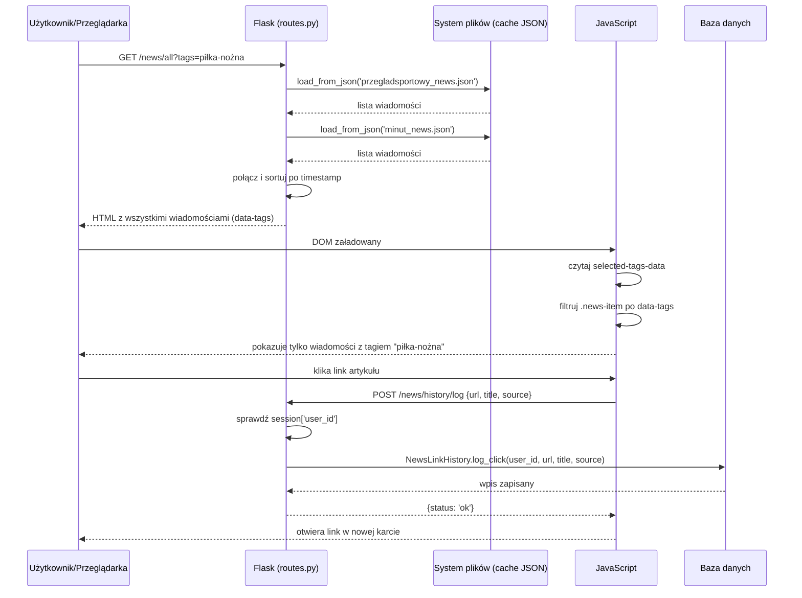
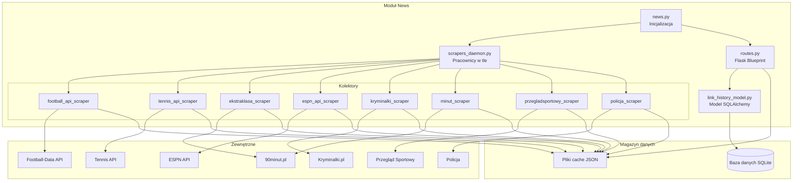

# Dokumentacja modułu News

## Spis treści
- [1. Cel modułu](#1-cel-modułu)
- [2. Zakres funkcjonalny (powiązanie z User Stories)](#2-zakres-funkcjonalny-powiązanie-z-user-stories)
- [3. Granice modułu (co wchodzi / co nie wchodzi)](#3-granice-modułu-co-wchodzi--co-nie-wchodzi)
- [4. Struktura kodu modułu](#4-struktura-kodu-modułu)
- [5. Interfejs modułu](#5-interfejs-modułu)
- [6. Zewnętrzne API wykorzystywane przez moduł](#6-zewnętrzne-api-wykorzystywane-przez-moduł)
- [7. Model danych modułu](#7-model-danych-modułu)
- [8. Przepływ danych w module](#8-przepływ-danych-w-module)
- [9. Diagramy modułu](#9-diagramy-modułu)
- [10. Testowanie modułu](#10-testowanie-modułu)
- [11. Ograniczenia, ryzyka, dalszy rozwój](#11-ograniczenia-ryzyka-dalszy-rozwój)
---

## 1. Cel modułu

Moduł `news` to system agregacji wiadomości sportowych i kryminalnych oraz wyświetlania wyników sportowych. Odpowiada za zbieranie danych z wielu źródeł zewnętrznych (zarówno poprzez API, jak i web scraping), cache'owanie ich w plikach JSON oraz prezentację użytkownikom w sposób czytelny i interaktywny. Moduł umożliwia personalizację treści poprzez system tagów i filtrów, a dla zalogowanych użytkowników oferuje dodatkowo śledzenie historii przeglądanych artykułów. Całość działa w architekturze z daemonami działającymi w tle, które automatycznie odświeżają dane w regularnych odstępach czasu, zapewniając aktualność informacji bez obciążania aplikacji podczas obsługi żądań użytkowników.

---

## 2. Zakres funkcjonalny (powiązanie z User Stories)

- **SCRUM-10** — Jako użytkownik chcę widzieć nagłówki wiadomości z zachęcającym mnie obrazkiem.
- **SCRUM-11** — Jako użytkownik chcę przeczytać artykuł w oryginalnym serwisie, ponieważ na nasze stronie znajduje się odnośnik.
- **SCRUM-12** — Jako niezalogowany użytkownik chcę widzieć wiadomości ze wszystkich kategorii w równych proporcjach.
- **SCRUM-13** — Jako użytkownik chcę wybrać swoje zainteresowania (np. siatkówkę), aby widzieć wiadomości z wybranych kategorii.
- **SCRUM-21** — Jako użytkownik chcę przeglądać tabele wybranych lig sportowych.
- **SCRUM-44** — Jako zalogowany użytkownik chcę przejrzeć historię przeczytanych artykułów, aby nie szukać ich ponownie.

---

## 3. Granice modułu (co wchodzi / co nie wchodzi)

### 3.1 Moduł odpowiada za
- Agregację wiadomości sportowych i kryminalnych z wielu źródeł
- Scraping danych z serwisów internetowych (Przegląd Sportowy, 90minut.pl, Kryminalki.pl, Policja)
- Pobieranie danych sportowych z API (Football-Data, ESPN, Tennis API)
- Cache'owanie danych w plikach JSON
- System daemonów odświeżających dane w tle
- Wyświetlanie tabel ligowych (piłka nożna, tenis, koszykówka, MLS)
- Filtrowanie wiadomości po tagach i zapisywanie preferencji użytkownika
- Śledzenie historii kliknięć artykułów przez zalogowanych użytkowników

### 3.2 Moduł nie odpowiada za
- Uwierzytelnianie użytkowników (moduł `auth`)
- Zarządzanie bazą użytkowników (moduł `auth`)
- Wyświetlanie strony głównej aplikacji (moduł `main`)
- Zarządzanie innymi modułami (ekonomia, pogoda)
- Tworzenie lub edycję treści wiadomości
- Hosting obrazków (tylko proxy)

---

## 4. Struktura kodu modułu

```
modules/news/
├── news.py                    # Punkt wejścia - inicjalizacja modułu
├── routes.py                  # Flask Blueprint z trasami HTTP
├── scrapers_daemon.py         # Daemony scrapujące w tle
├── link_history_model.py      # Model SQLite historii kliknięć
└── collectors/                # Scrapery dla różnych źródeł
    ├── __init__.py
    ├── football_api_scraper.py      # Football-Data.org API
    ├── tennis_api_scraper.py        # Tennis API (RapidAPI)
    ├── ekstraklasa_scraper.py       # 90minut.pl (tabele PL)
    ├── espn_api_scraper.py          # ESPN API (NBA, MLS)
    ├── kryminalki_scraper.py        # Kryminalki.pl
    ├── minut_scraper.py             # 90minut.pl (wiadomości)
    ├── przegladsportowy_scraper.py  # Przegląd Sportowy
    └── policja_scraper.py           # Policja Kraków/Małopolska

data/news/                     # Dane cache w JSON
├── football-data/             # Tabele piłkarskie (API)
├── tennis-API/                # Rankingi ATP/WTA (API)
├── 90minut/                   # Polskie ligi (scraping)
├── ESPN-API/                  # NBA i MLS (API)
└── [źródła]/                  # Wiadomości (scraping)

templates/news/                # Szablony HTML
├── news_base.html             # Bazowy szablon z nawigacją
├── news_main.html             # Strona główna wiadomości
├── news_all.html              # Wszystkie wiadomości z filtrami
├── tables.html                # Tabele ligowe
└── history.html               # Historia kliknięć

static/
├── css/news.css              # Style modułu
└── js/
    ├── news-filters.js       # Filtrowanie po tagach
    └── news-history.js       # Historia kliknięć
```
### Collectors (Scrapery)

#### 1. `football_api_scraper.py`

**Funkcje:**
- `get_available_competitions()` - lista dostępnych rozgrywek z pliku JSON
- `get_competition_info(competition_code)` - szczegóły rozgrywek z API
- `get_football_standings(competition_code, season, skip_competition_info)` - tabela ligowa

**Zwracany format:**
```python
{
    'standings': [... ],           # Lista drużyn
    'competition_name': str,      # Nazwa rozgrywek
    'competition_emblem': str,    # URL do logo
    'season_info': {... },         # Informacje o sezonie
    'available_seasons': [...],   # Dostępne sezony
    'error': str or None
}
```

**Rozgrywki:** Liga Mistrzów, Premier League, Bundesliga, Serie A, La Liga, Ligue 1, Eredivisie, Primeira Liga, Championship

#### 2. `tennis_api_scraper.py`

**API:** Tennis API (RapidAPI - wymaga klucza)

**Funkcje:**
- `get_atp_rankings(limit=20)` - ranking ATP (mężczyźni)
- `get_wta_rankings(limit=20)` - ranking WTA (kobiety)

**Zwracany format:**
```python
[
    {
        'ranking':  int,
        'team': {
            'name': str,
            'country': str
        },
        'points': int
    },
    ...
]
```

#### 3. `ekstraklasa_scraper.py`

**Źródło:** 90minut.pl (scraping)

**Funkcje:**
- `get_emblems_map(id_rozgrywki)` - mapa logo drużyn
- `get_90minut_table(url, id_rozgrywki)` - tabela ligowa
- `get_ekstraklasa_table()` - Ekstraklasa (ID: 14072)
- `get_first_league_table()` - I Liga (ID: 14073)
- `get_second_league_table()` - II Liga (ID: 14074)

**Zwracany format:**
```python
{
    'standings': [
        {
            'position': int,
            'team_name': str,
            'crest': str,           # URL do logo
            'playedGames': int,
            'won': int,
            'draw':  int,
            'lost': int,
            'points': int
        },
        ...
    ],
    'error': str or None
}
```

---

### 4. `espn_api_scraper.py`

**API:** ESPN (publiczne, bez klucza)

**Funkcje:**
- `get_nba_standings()` - tabela NBA
- `get_mls_standings()` - tabela MLS

**Zwracany format:**
```python
{
    'data': {
        'children': [           # Konferencje
            {
                'name': str,
                'standings': {... }
            },
            ...
        ]
    },
    'error':  str or None
}
```

---

### 5. `kryminalki_scraper.py`

**Źródło:** kryminalki.pl (scraping)

**Funkcja:**
- `get_kryminalki_news(limit=10)` - wiadomości kryminalne

**Zwracany format:**
```python
[
    {
        'title': str,
        'link': str,
        'image': str or None,
        'date': str,            # Format: DD.MM.RRRR HH:MM
        'timestamp': int,       # Unix timestamp
        'tags': [str, ...]      # np. ['kryminalne', 'Kraków']
    },
    ... 
]
```

**Mapowanie tagów:**
```python
TAG_MAPPING = {
    'Kraków': ['kryminalne', 'Kraków'],
    'Małopolska': ['kryminalne', 'Małopolska'],
    ... 
}
```

---

### 6. `minut_scraper.py`

**Źródło:** 90minut.pl (scraping)

**Funkcja:**
- `get_minut_news(limit=10)` - wiadomości piłkarskie

**Zwracany format:**
```python
[
    {
        'title':  str,
        'link': str,
        'image': str or None,
        'date': str,
        'timestamp': int,
        'tags': ['piłka-nożna']
    },
    ...
]
```

**Uwaga:** Scraper wchodzi na każdą stronę artykułu aby pobrać datę z `<blockquote>` → drugi `<p>`.

---

### 7. `przegladsportowy_scraper.py`

**Źródło:** przegladsportowy.onet.pl (scraping)

**Funkcje:**
- `_parse_polish_date(date_raw)` - parsuje polską datę
- `_fetch_news_from_category(category_slug, limit)` - pobiera z kategorii
- `get_przegladsportowy_news(limit=30)` - wiadomości z wielu kategorii

**Kategorie:**
```python
CATEGORY_TAG_MAP = {
    'pilka-nozna': 'piłka-nożna',
    'tenis': 'tenis',
    'siatkowka': 'siatkówka',
    'zuzel': 'żużel',
    'lekkoatletyka': 'lekkoatletyka'
}
```

**Zwracany format:**
```python
[
    {
        'title': str,
        'link': str,
        'image': str or None,
        'date': str,
        'timestamp': int,
        'tags':  [str, ...]
    },
    ... 
]
```

---

### 8. `policja_scraper.py`

**Źródło:** Strony policji (Kraków, Małopolska)

**Funkcje:**
- `scrape_policja_news(url, tags, limit)` - uniwersalny scraper
- `get_policja_krakow_news(limit=10)`
- `get_policja_malopolska_news(limit=10)`

**Zwracany format:**
```python
[
    {
        'title': str,
        'link': str,
        'image': str or None,
        'date': str,           # Tylko data, bez godziny
        'timestamp': None,
        'tags': ['kryminalne', 'Kraków']  # lub 'Małopolska'
    },
    ...
]
```

**Struktura HTML:** `div#content` → `ul` → `li.news` → `strong`, `img`, `span. data`

---

## System daemonów

### `scrapers_daemon.py`

Daemony działają w osobnych wątkach i pobierają dane w regularnych odstępach czasu. 

**Główna funkcja:**
```python
def start_all_daemons():
    """
    Uruchamia wszystkie daemony w osobnych wątkach.
    Każdy daemon działa w nieskończonej pętli i zapisuje dane do JSON.
    """
```

**Kluczowe funkcje pomocnicze:**

#### `get_warsaw_time()`
```python
return datetime.now(WARSAW_TZ).strftime('%d.%m.%Y   %H:%M:%S')
```
Zwraca aktualny czas w Warszawie.

#### `save_to_json(filepath, data)`
**Bezpieczny zapis:**
- Sprawdza czy są dane do zapisania
- **NIE nadpisuje** pliku jeśli dane są puste (zapobiega utracie danych przy błędzie)
- Tworzy katalogi jeśli nie istnieją
- Zapisuje z `ensure_ascii=False` i `indent=2`

#### `load_*_config()`
Funkcje wczytujące konfigurację z plików JSON: 
- `load_football_config()`
- `load_football_competitions()`
- `load_tennis_config()`
- `load_ekstraklasa_config()`
- `load_espn_config()`

**Struktura daemona:**
```python
def football_daemon():
    while True:
        try:
            competitions = load_football_competitions()
            for comp in competitions:
                data = get_football_standings(comp['code'], skip_competition_info=True)
                save_to_json(f'data/news/football-data/{comp["code"]}.json', {
                    'data': data,
                    'updated_at': get_warsaw_time()
                })
            time.sleep(config['refresh_interval'])  
        except Exception as e:
            print(f"Błąd w football_daemon: {e}")
            time.sleep(60)
```

**Uruchamianie:**
```python
thread = threading.Thread(target=football_daemon, daemon=True, name="FootballDaemon")
thread.start()
```

**Lista daemonów:**
1. `football_daemon` - tabele piłkarskie (football-data.org API)
2. `tennis_daemon` - rankingi ATP/WTA (Tennis API)
3. `ekstraklasa_daemon` - polskie ligi (90minut. pl)
4. `nba_mls_daemon` - NBA i MLS (ESPN API)
5. `news_daemon` - wiadomości z wszystkich źródeł

---

## 5. Interfejs modułu

Poniżej przedstawiono endpointy udostępniane przez ten moduł.
Szczegółowa specyfikacja każdego endpointu (parametry, odpowiedzi, błędy)
znajduje się w pliku [`doc/api_reference.md`](../api_reference.md).

| Metoda | Ścieżka | Typ | Rola w module | Powiązane User Stories | Szczegóły |
|---:|---|---|---|---|---|
| GET | /news | HTML | Strona główna wiadomości | SCRUM-10, SCRUM-12 | api_reference.md#news-main |
| GET | /news/all | HTML | Wszystkie wiadomości z filtrami | SCRUM-10, SCRUM-12, SCRUM-13 | api_reference.md#news-all |
| GET | /news/tables | HTML | Tabele ligowe | SCRUM-21 | api_reference.md#news-tables |
| GET | /news/history/view | HTML | Historia kliknięć (widok) | SCRUM-44 | api_reference.md#news-history-view |
| GET | /news/history/api | JSON | Historia kliknięć (API) | SCRUM-44 | api_reference.md#news-history-api |
| POST | /news/history/log | JSON | Logowanie kliknięcia | SCRUM-44 | api_reference.md#news-history-log |
| POST | /news/history/delete/:id | JSON | Usuwanie wpisu historii | SCRUM-44 | api_reference.md#news-history-delete |
| POST | /news/history/clear | JSON | Czyszczenie całej historii | SCRUM-44 | api_reference.md#news-history-clear |
| GET | /news/image_proxy | Image | Proxy obrazków z policji | SCRUM-10 | api_reference.md#news-image-proxy |

---

## 6. Zewnętrzne API wykorzystywane przez moduł

### 6.1 Źródła danych

Moduł wykorzystuje 3 zewnętrzne API i 5 scrapowanych serwisów.

#### API

**1. Football-Data.org API**

| Właściwość | Wartość |
|------------|---------|
| **Dokumentacja** | https://www.football-data.org/documentation/quickstart |
| **Base URL** | `https://api.football-data.org/v4` |
| **Autentykacja** | Header: `X-Auth-Token: YOUR_API_KEY` |
| **Przykładowe zapytanie** | `GET https://api.football-data.org/v4/competitions/PL/standings` |
| **Dane** | Tabele ligowe: Liga Mistrzów (CL), Premier League (PL), Bundesliga (BL1), Serie A (SA), La Liga (PD), Ligue 1 (FL1), Eredivisie (DED), Primeira Liga (PPL), Championship (ELC), Brasileiro Série A (BSA) |
| **Limit zapytań** | 10 zapytań/minutę |
| **Format odpowiedzi** | JSON |
| **Zmienna środowiskowa** | `FOOTBALL_API_KEY` |

#### 2. ESPN API

| Właściwość | Wartość |
|------------|---------|
| **Dokumentacja** | Brak oficjalnej (publiczne API) |
| **Base URL** | `https://site.api.espn.com/apis/v2/sports` |
| **Autentykacja** | Brak (publiczne) |
| **Przykładowe zapytanie NBA** | `GET https://site.api.espn.com/apis/v2/sports/basketball/nba/standings` |
| **Dane** | Tabele NBA (konferencje Eastern/Western), tabele MLS (konferencje) |
| **Limit zapytań** | Brak |
| **Format odpowiedzi** | JSON |
| **Zmienna środowiskowa** | Brak (nie wymaga klucza) |

#### 3. Tennis API (RapidAPI)

| Właściwość | Wartość |
|------------|---------|
| **Dokumentacja** | https://rapidapi.com/fluis.lacasse/api/tennisapi1/ |
| **Base URL** | `https://tennisapi1.p.rapidapi.com/api/tennis` |
| **Autentykacja** | Headers: `X-RapidAPI-Key`, `X-RapidAPI-Host: tennisapi1.p.rapidapi.com` |
| **Przykładowe zapytanie** | `GET https://tennisapi1.p.rapidapi.com/api/tennis/rankings/atp` |
| **Dane** | Rankingi ATP (mężczyźni), rankingi WTA (kobiety) - top 20 zawodników |
| **Limit zapytań** | Zależny od planu RapidAPI (podstawowy: 500/dzień) |
| **Format odpowiedzi** | JSON |
| **Zmienna środowiskowa** | `RAPIDAPI_KEY` |

#### Scrapowane serwisy

**1. Kryminalki.pl**

| Właściwość | Wartość |
|------------|---------|
| **URL** | https://www.kryminalki.pl |
| **Typ danych** | Wiadomości kryminalne |
| **Metoda** | Web scraping (BeautifulSoup) |
| **Pobierane dane** | Tytuł, link, obrazek, data, lokalizacja |

#### 2. Przegląd Sportowy (Onet.pl)

| Właściwość | Wartość |
|------------|---------|
| **URL** | https://przegladsportowy.onet.pl |
| **Typ danych** | Wiadomości sportowe (wielokategoriowe) |
| **Metoda** | Web scraping (BeautifulSoup) |
| **Kategorie** | piłka-nożna, tenis, siatkówka, żużel, lekkoatletyka |
| **Struktura URL** | `/kategoria/{kategoria}/` |
| **Pobierane dane** | Tytuł, link, obrazek, data (polska), tagi |

#### 3. 90minut.pl

| Właściwość | Wartość |
|------------|---------|
| **URL wiadomości** | http://www.90minut.pl |
| **URL tabel** | `http://www.90minut.pl/liga/liga.php?id_liga={1,2,3}` |
| **Typ danych** | Wiadomości piłkarskie + tabele polskich lig |
| **Metoda** | Web scraping (BeautifulSoup) |
| **Tabele** | Ekstraklasa (id: 14072), I Liga (id: 14073), II Liga (id: 14074) |
| **Pobierane dane wiadomości** | Tytuł, link, obrazek, data (z osobnej strony artykułu) |
| **Pobierane dane tabel** | Pozycja, nazwa drużyny, emblem, mecze, wygrane, remisy, przegrane, punkty |

#### 4. Policja Kraków

| Właściwość | Wartość |
|------------|---------|
| **URL** | https://krakow.policja.gov.pl |
| **Typ danych** | Komunikaty policji Krakowa |
| **Metoda** | Web scraping (BeautifulSoup) |
| **Struktura** | `<div id="content">` → `<ul>` → `<li class="news">` |

#### 5. Policja Małopolska

| Właściwość | Wartość |
|------------|---------|
| **URL** | https://malopolska.policja.gov.pl |
| **Typ danych** | Komunikaty policji Małopolskiej |
| **Metoda** | Web scraping (BeautifulSoup) |
| **Pobierane dane** | Tytuł (`<strong>`), obrazek (``), data (`<span class="data">`) |

### 6.2 Obsługa błędów i fallback

**Błędy API:**
- W przypadku błędu API, dane są pobierane z ostatniego cache (pliki JSON)
- Daemon kontynuuje próby pobierania w kolejnych cyklach
- Jeśli brak cache i błąd API → wyświetlany komunikat błędu użytkownikowi

**Błędy scrapingu:**
- Zmiany struktury HTML są logowane w konsoli
- Daemon zapisuje puste dane tylko jeśli `save_to_json` wykryje rzeczywiste dane (zabezpieczenie przed nadpisaniem cache)
- Automatyczna próba ponowienia po 60s w przypadku wyjątku

---

## 7. Model danych modułu

### 7.1 Encje bazodanowe (tabele)

#### `NewsLinkHistory`

**Tabela:** `news_link_history`

**Rola:** Przechowuje historię kliknięć w linki artykułów przez zalogowanych użytkowników (SCRUM-44).

**Kluczowe pola:**
```python
id            # Integer, Primary Key
user_id       # Integer, Foreign Key → users.id (indeksowane)
link_url      # String(500), URL artykułu
link_title    # String(300), Tytuł artykułu (opcjonalny)
clicked_at    # DateTime, Czas kliknięcia (indeksowane, default: UTC now)
source        # String(50), Źródło wiadomości (np. 'kryminalki', 'przegladsportowy')
```

**Relacje:**
- `user_id` → `User` (moduł auth) - relacja many-to-one

**Metody modelu:**
- `log_click(user_id, link_url, link_title, source)` - zapisuje kliknięcie
- `get_user_history(user_id, limit=200)` - pobiera historię użytkownika
- `get_stats_by_source(user_id)` - statystyki pogrupowane po źródłach
- `clear_user_history(user_id)` - usuwa całą historię użytkownika
- `delete_entry(entry_id, user_id)` - usuwa pojedynczy wpis

### 7.2 Obiekty domenowe (bez tabel w bazie)

#### Obiekt `NewsArticle` (pochodzenie: scrapery/API)

```python
{
    'title': str,           # Tytuł artykułu
    'link': str,            # URL do pełnego artykułu
    'image': str or None,   # URL do obrazka
    'date': str,            # Data w formacie DD.MM.RRRR HH:MM
    'timestamp': int,       # Unix timestamp (dla sortowania)
    'tags': [str, ...],     # Lista tagów (kategorie)
    'source': str           # Źródło (np. 'kryminalki')
}
```

**Źródło:** Wszystkie scrapery wiadomości zwracają listę takich obiektów.

#### Obiekt `LeagueStanding` (pochodzenie: Football API)

```python
{
    'position': int,
    'team': {
        'name': str,
        'crest': str       # URL do herbu
    },
    'playedGames': int,
    'won': int,
    'draw': int,
    'lost': int,
    'points': int,
    'goalsFor': int,
    'goalsAgainst': int,
    'goalDifference': int
}
```

#### Obiekt `TennisRanking` (pochodzenie: Tennis API)

```python
{
    'ranking': int,
    'team': {
        'name': str,
        'country': str
    },
    'points': int
}
```

#### Obiekt konfiguracyjny `CompetitionConfig`

```python
{
    'code': str,            # Kod rozgrywek (np. 'PL', 'CL')
    'name': str,            # Nazwa rozgrywek
    'area': str,            # Region (np. 'Europa', 'Anglia')
    'type': str             # Typ (np. 'LEAGUE', 'CUP', 'INTERNATIONAL')
}
```

**Źródło:** Pliki `*_config.json` w `data/news/`

### 7.3 Relacje i przepływ danych

```
[Zewnętrzne źródło] (API/HTML)
        ↓
[Collector/Scraper] - pobiera dane
        ↓
[Scrapers Daemon] - periodyczne odświeżanie
        ↓
[Pliki JSON] (cache) - zapis z timestampem
        ↓
[Routes Blueprint] - odczyt cache
        ↓
[Szablony HTML] - renderowanie
        ↓
[User Browser] - wyświetlanie
        ↓
[JavaScript] - kliknięcie linku
        ↓
[POST /news/history/log] - logowanie (jeśli zalogowany)
        ↓
[NewsLinkHistory] - zapis do bazy
```

---

## 8. Przepływ danych w module

**Scenariusz: Użytkownik przegląda wiadomości sportowe z wybraną kategorią (SCRUM-13)**

1. **Użytkownik:** Wchodzi na `/news/all?tags=piłka-nożna`
2. **Routes (`news_view()`):**
   - Odczytuje parametr `tags` z query string
   - Wczytuje dane z plików JSON:
     - `przegladsportowy_news.json`
     - `minut_news.json`
     - `kryminalki_news.json`
     - `policja_krakow_news.json`
     - `policja_malopolska_news.json`
   - Łączy wszystkie wiadomości w jedną listę
   - Sortuje po `timestamp` (malejąco)
3. **Template (`news_all.html`):**
   - Renderuje wszystkie wiadomości z atrybutem `data-tags`
   - Przekazuje wybrane tagi do JavaScript
4. **JavaScript (`news-filters.js`):**
   - Inicjalizuje widoczność wiadomości według tagów
   - Pokazuje tylko artykuły z tagiem "piłka-nożna"
5. **Użytkownik:** Klika w link artykułu
6. **JavaScript (`news-history.js`):**
   - Event listener przechwytuje kliknięcie
   - Wysyła POST `/news/history/log` z: `{url, title, source}`
7. **Routes (`history_log()`):**
   - Sprawdza czy użytkownik zalogowany (`session['user_id']`)
   - Wywołuje `NewsLinkHistory.log_click()`
8. **Model (`NewsLinkHistory`):**
   - Tworzy nowy wpis w bazie danych
   - Zapisuje: user_id, link_url, link_title, clicked_at, source
9. **Użytkownik:** Przekierowywany do oryginalnego artykułu w nowej karcie

**W tle (równolegle):**
- **Scrapers Daemon:** Co 300s (5 min) odświeża `przegladsportowy_news.json` i inne pliki wiadomości
- Daemon czyta konfigurację → wywołuje scrapery → zapisuje do JSON z timestampem

---

## 9. Diagramy modułu

### 9.1 Diagram sekwencji (dla SCRUM-13: Filtrowanie wiadomości)



### 9.2 Diagram komponentów modułu



---

## 10. Testowanie modułu

Szczegóły: [`doc/testing.md`](../testing.md) i [`doc/news_tests_plan.md`](../news_tests_plan.md)

### 10.1 Unit tests (pytest)

**Co testujemy:**
- Funkcje scraperów (collectors) - parsowanie HTML/JSON
- Funkcje pomocnicze: `localize_competition_name()`, `load_from_json()`
- Model `NewsLinkHistory` - metody CRUD
- Parsowanie dat: `_parse_polish_date()` w `przegladsportowy_scraper.py`

**Przykłady:**
```python
# test_football_api_scraper.py
def test_get_football_standings_returns_data()
def test_get_football_standings_invalid_code()

# test_link_history_model.py  
def test_log_click_creates_entry()
def test_get_user_history_returns_sorted()
def test_delete_entry_only_own()
```

### 10.2 Integration tests (HTML/API)

**Endpointy testowane:**
- `GET /news` - status 200, obecność kluczowych elementów HTML
- `GET /news/all?tags=piłka-nożna` - filtrowanie po tagach
- `GET /news/tables?competition=PL` - tabele piłkarskie
- `POST /news/history/log` - logowanie kliknięcia (wymaga sesji)
- `GET /news/history/api` - pobieranie historii JSON
- `POST /news/history/clear` - czyszczenie historii

**Sprawdzamy:**
- Poprawne kody HTTP
- Struktura JSON odpowiedzi
- Wymagana autoryzacja dla chronionych endpointów
- Walidacja parametrów (brak url, nieprawidłowy competition code)

### 10.3 Acceptance tests (Playwright)

**Mapowanie User Stories → Testy:**

| User Story | Test E2E | Plik testu |
|---|---|---|
| SCRUM-10 | Nagłówki wiadomości z obrazkami | `test_news_thumbnails.py` |
| SCRUM-11 | Kliknięcie otwiera oryginalny artykuł | `test_news_external_links.py` |
| SCRUM-12 | Niezalogowany widzi wszystkie kategorie | `test_news_anonymous_view.py` |
| SCRUM-13 | Filtrowanie po tagach | `test_news_tag_filtering.py` |
| SCRUM-21 | Przeglądanie tabel ligowych | `test_news_tables_view.py` |
| SCRUM-44 | Historia przeczytanych artykułów | `test_news_history.py` |

**Przykładowe scenariusze:**
- Użytkownik wybiera tag "siatkówka" → tylko artykuły z tym tagiem są widoczne
- Użytkownik klika artykuł → nowa karta z oryginalnym serwisem + wpis w historii
- Zalogowany użytkownik wchodzi w historię → widzi listę klikniętych artykułów
- Użytkownik wybiera ligę z dropdown → tabela się aktualizuje

---

## 11. Ograniczenia, ryzyka, dalszy rozwój

### 11.1 Ograniczenia

**Techniczne:**
- **Limity API:** Football-Data (10 req/min), Tennis API (500/dzień na planie podstawowym)
- **Scraping:** Zależność od struktury HTML zewnętrznych serwisów - każda zmiana może złamać scraper
- **Cache:** Stare dane w JSON jeśli daemon się zatrzyma lub API nie działa

---

### 11.2 Ryzyka
   
1. **Zmiany w HTML serwisów:**
   - Scrapowane strony mogą zmienić layout
   - **Rozwiązanie:** Regularne sprawdzanie scraperów
   
2. **Blokowanie IP:**
   - Serwisy mogą zablokować częste zapytania
   - **Rozwiązanie:** Zmiana metody scrapowania, zwiększenie interwału
   

**KONIEC**