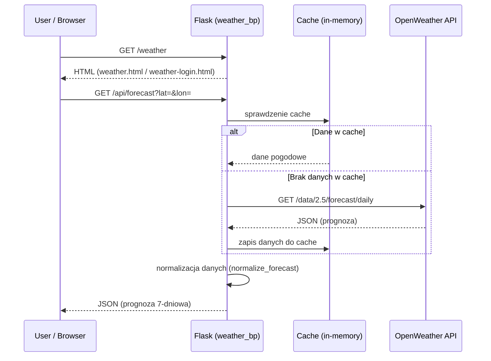

# Architektura modułu: Moduł `weather`

> **Cel dokumentu:**  
> Ten dokument odpowiada na pytanie: **„Jak ten konkretny moduł działa i na jakich danych operuje?”**  


---

## 1. Cel modułu

Użytkownicy mogą przeglądać informacje pogodowe dla domyślnej i wyszukiwanej lokalizacji bez konieczności logowania. Po zalogowaniu otrzymują możliwość personalizacji poprzez zapisywanie ulubionych lokalizacji i otrzymywanie powiadomień w aplikacji/na maila o określonych warunkach pogodowych, takich jak opady śniegu lub ujemne temperatury.

---

## 2. Zakres funkcjonalny (powiązanie z User Stories)

- **US-WEATHER-23** - Jako użytkownik niezalogowany chcę zobaczyć informacje o temperaturze, opadach i ciśnieniu dla domyślnej lokalizacji, aby od razu mieć dostęp do podstawowych danych pogodowych bez konieczności podejmowania akcji

- **US-WEATHER-26** - Jako użytkownik niezalogowany Chcę móc wyszukać inną lokalizację Aby sprawdzić warunki pogodowe w interesującym mnie miejscu


- **US-WEATHER-27** - Jako zalogowany użytkownik Chcę mieć możliwość zapisywania wybranych lokalizacji jako ulubione i będą one się wyświetlały jednocześnie na stronie serwisu, Aby móc szybko sprawdzać pogodę w często sprawdzanych miejscach


- **US-WEATHER-28** - Jako zalogowany użytkownik Chcę otrzymywać powiadomienia e-mail, gdy prognozowane są opady w moich ulubionych lokalizacjach Aby przygotować się na trudne warunki pogodowe

- **US-WEATHER-29** - Jako zalogowany użytkownik Chcę otrzymywać powiadomienia e-mail, gdy temperatura w moich ulubionych lokalizacjach spadnie poniżej 0°C Aby lepiej się przygotować na mroźne dni

- **US-WEATHER-45** - Jako użytkownik chcę widzieć pogodę w postaci piktogramów, aby w prosty sposób móc odczytać warunki pogodowe.

- **US-WEATHER-47** - Jako użytkownik chcę zobaczyć prognozę pogody w wybranej lokalizacji na 7 dni do przodu.

- **US-WEATHER-49** - Jako użytkownik zalogowany chcę zobaczyć wykres liniowy temperatury i słupkowy opadów na 7 dni, aby móc porównać zmiany pogodowe.


---

## 3. Granice modułu (co wchodzi / co nie wchodzi)

### 3.1 Moduł odpowiada za
- Pobieranie danych pogodowych z API OpenWeatherMap
- Przetwarzanie i cachowanie odpowiedzi API
- Zarządzanie ulubionymi miastami użytkowników
- Wysyłanie alertów e-mailowych
- Generowanie wykresów pogodowych
- Obsługę błędów API i fallback

### 3.2 Moduł nie odpowiada za
- Autoryzację użytkowników (korzysta z modułu auth)
- Zarządzanie bazą danych (korzysta z modułu database)
- Pobieranie newsów lub danych ekonomicznych

---

## 4. Struktura kodu modułu

Główny plik modułu: `modules/weather_app.py` zawierający wszystkie funkcje i endpointy.

- `modules/weather_app.py` — główna logika modułu, funkcje API, cache, wysyłanie e-maili
- `templates/weather/weather.html` — szablon dla użytkowników anonimowych
- `templates/weather/weather-login.html` — szablon dla użytkowników zalogowanych (z ulubionymi miastami)
- `static/js/weather_app.js` — JavaScript do interakcji z UI
- `static/js/weather_icons.js` — mapowanie ikon pogodowych
- `static/css/weather_styles.css` — style dla strony pogodowej
- `tests/unit/test_weather_unit.py` — testy jednostkowe
- `tests/integration/test_weather_endpoints.py` — testy integracyjne endpointów
- `tests/integration/test_weather_more.py` — dodatkowe testy integracyjne
- `tests/e2e/test_anonymus_weather.py` — testy end-to-end

---

## 5. Interfejs modułu


| Metoda | Ścieżka | Typ | Rola w module | Powiązane User Stories | Szczegóły |
|---:|---|---|---|---|---|
| GET | /weather | HTML | Widok główny pogody | US-WEATHER-23 | Wyświetla stronę pogodową |
| GET | /api/forecast | JSON | Prognoza 7-dniowa | US-WEATHER-47 | api_reference.md#weather-forecast |
| GET | /api/hourly | JSON | Prognoza godzinowa | US-WEATHER-49 | api_reference.md#weather-hourly |
| GET | /api/geocode | JSON | Geokodowanie miasta | US-WEATHER-26 | api_reference.md#weather-geocode |
| GET | /api/favorites | JSON | Lista ulubionych miast | US-WEATHER-27 | api_reference.md#weather-favorites-get |
| POST | /api/favorites | JSON | Dodanie ulubionego miasta | US-WEATHER-27 | api_reference.md#weather-favorites-post |
| DELETE | /api/favorites/<id> | JSON | Usunięcie ulubionego miasta | US-WEATHER-27 | api_reference.md#weather-favorites-delete |
| GET | /plot.png | PNG | Wykres pogodowy | US-WEATHER-49 | api_reference.md#weather-plot |
| GET | /api/test-email | JSON | Test wysyłania e-maila | US-WEATHER-28/29 | api_reference.md#weather-test-email |


---

## 6. Zewnętrzne API wykorzystywane przez moduł

Moduł korzysta z API OpenWeatherMap do pobierania danych pogodowych.
Endpointy:
- **7-dniowa prognoza dzienna (dla kafelków)**

DAILY_URL = "https://api.openweathermap.org/data/2.5/forecast/daily"
- **5-dniowa prognoza co 3 godziny (dla wykresu 24h)**

HOURLY_URL = "https://api.openweathermap.org/data/2.5/forecast"
- **geokodowanie nazw miast**

GEOCODE_URL = "https://api.openweathermap.org/geo/1.0/direct"
- Autoryzacja poprzez klucz api.
- Lmity: 3,000 API calls/min and 100,000,000 API calls/miesiąc

**Z odpowiedzi API wykorzystywane są m.in. następujące pola:**

- city.name – nazwa miasta

- city.coord.lat, city.coord.lon – współrzędne geograficzne

- city.timezone – przesunięcie strefy czasowej

- list[].dt – znacznik czasu (UNIX, UTC)

- list[].temp.min – temperatura minimalna

- list[].temp.max – temperatura maksymalna

- list[].temp.day – temperatura dzienna

- list[].pressure – ciśnienie atmosferyczne

- list[].rain – ilość opadów deszczu (mm)

- list[].snow – ilość opadów śniegu (mm)

- list[].weather[0].icon – kod ikony pogody

- list[].weather[0].description – opis warunków pogodowych

### 6.1 Konfiguracja (zmienne `.env`)

| Zmienna | Przykład | Opis | Wymagana |
|---|---|---|---|
| OPENWEATHER_API_KEY | 3c4d926e6a63030571954b43415a7367 | Klucz API do OpenWeatherMap | TAK |

> Szczegóły: [`doc/setup.md`](../setup.md)

### 6.2 Przykład zapytania do API (opcjonalnie)

```bash
curl "https://api.openweathermap.org/data/2.5/forecast/daily?lat=50.06&lon=19.94&appid=YOUR_API_KEY&units=metric&cnt=7"
```

### 6.3 Obsługa błędów i fallback

W przypadku błędów API (np. 429 - rate limit, 401 - invalid key), moduł zwraca błąd 502 z komunikatem "Błąd OpenWeather". Dane są cachowane na 1 minutę, aby zmniejszyć liczbę zapytań. Jeśli API nie działa, użytkownik widzi komunikat o błędzie zamiast danych pogodowych. Błędy wynikające z niepoprawnych parametrów wejściowych (np. błędne współrzędne) skutkują odpowiedzią 400 (Bad Request). W przypadku braku danych użytkownika stosowana jest domyślna lokalizacja (Kraków).

---

## 7. Model danych modułu

> **Cel tej sekcji:**  
> Opisać **wszystkie dane**, na których operuje moduł.  
> Obejmuje to zarówno **encje bazodanowe**, jak i **obiekty domenowe bez własnych tabel**.

> **Ważne:**  
> Nie powtarzaj tutaj pełnego opisu encji wspólnych całej aplikacji  
> (np. `User`). Możesz się do nich odwołać.

---

### 7.1 Encje bazodanowe (tabele)

- **Favorite**: Przechowuje ulubione miasta użytkowników
  - Pola: id, user_id, city, lat, lon, created_at
  - Relacje: należy do User (user_id)

### 7.2 Obiekty domenowe (bez tabel w bazie)

- **ForecastData**: Struktura danych prognozy z API OpenWeatherMap, zawierająca listę dni z temperaturami, opisem pogody, ikonami itp.
- **GeocodeResult**: Wyniki geokodowania miasta na współrzędne lat/lon
- **WeatherAlert**: Obiekt zawierający informacje o alertach pogodowych (deszcz, śnieg, mróz) dla miast

### 7.3 Relacje i przepływ danych

Dane przepływają od API OpenWeatherMap → cache w pamięci → przetwarzanie w funkcji → baza danych (ulubione miasta) → odpowiedź JSON/HTML do użytkownika. Alerty e-mailowe są wysyłane asynchronicznie na podstawie danych pogodowych.

---

## 8. Przepływ danych w module

Scenariusz: Użytkownik chce zobaczyć prognozę pogody dla Warszawy (US-WEATHER-26)

1. Użytkownik otwiera /pogoda i wprowadza miasto "Warszawa"
2. Frontend wywołuje /api/geocode?q=Warszawa aby uzyskać współrzędne
3. Moduł odpytuje API OpenWeatherMap Geocoding i cachuje wynik
4. Frontend wywołuje /api/forecast?lat=...&lon=... dla prognozy
5. Moduł odpytuje API OpenWeatherMap Forecast, cachuje i przetwarza dane
6. Dane są zwracane jako JSON i wyświetlane w UI

---

## 9. Diagramy modułu (wymagane)

### 9.1 Diagram sekwencji dla US-WEATHER-26 – użytkownik chce zobaczyć prognozę pogody dla Warszawy.

**Opcja: Mermaid**



---

## 10. Testowanie modułu

Szczegóły: [`doc/testing.md`](../testing.md)

### 10.1 Unit tests (pytest)
Testy jednostkowe obejmują: funkcje przetwarzania danych pogodowych, cache, normalizację forecast, wysyłanie e-maili (z mockowaniem SMTP).

### 10.2 Integration tests (HTML/API)
Testowane endpointy: /api/forecast, /api/geocode, /api/favorites, /api/hourly, /weather/plot.png, test wysyłania maili, obsługa błędów API.

### 10.3 Acceptance tests (Playwright)
- `test_anonymous_user_weather` — Wyświetlanie podstawowych danych pogodowych dla użytkownika anonimowego.
- `test_anonymous_user_can_search_location` — Wyszukiwanie pogody dla innego miasta.
- `test_logged_in_user_sees_favorites_section` — Widoczność sekcji ulubionych dla zalogowanego użytkownika.
- `test_logged_in_user_can_add_and_view_favorite` — Dodawanie i wyświetlanie ulubionego miasta.
- `test_email_alerts_for_weather_conditions` — Wysyłanie alertów e-mailowych o warunkach pogodowych.
- `test_weather_icons_visible` — Wyświetlanie ikon pogodowych.
- `test_7_day_forecast_visible` — Wyświetlanie prognozy na 7 dni.
- `test_charts_visible_for_anonymous_user` — Wyświetlanie wykresów pogodowych.

---

## 11. Ograniczenia, ryzyka, dalszy rozwój

- **Ograniczenia**: Zależność od zewnętrznego API OpenWeatherMap (limity, koszty, dostępność). Cache tylko w pamięci (utrata przy restarcie). Obsługa e-maili jest ograniczona do SMTP Gmail, brak wsparcia dla innych dostawców. Aktualna prognoza godzinowa obejmuje maksymalnie 5 dni (z powodu ograniczeń API).
- **Ryzyka**: Błędy API mogą powodować niedostępność danych pogodowych. Duża liczba użytkowników może spowodować przeciążenie serwera przy równoczesnych zapytaniach.
- **Dalszy rozwój**: Rozszerzenie alertów o wiatr, wilgotność, burze lub inne parametry pogodowe, wprowadzenie personalizacji alertów (np. preferencje użytkownika co do prognoz i progów temperatury/opadów), integracja z wieloma dostawcami API, powiadomienia push.
